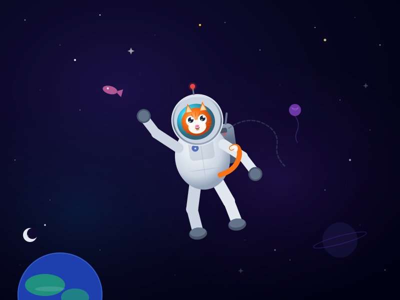
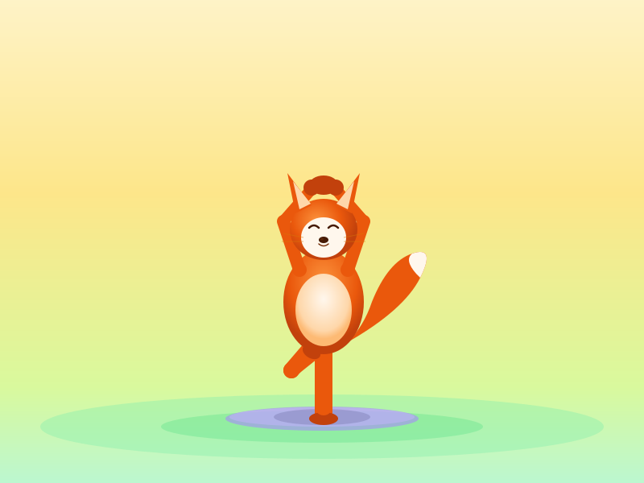

# 🎨 SVG Creator Skill

**An Agent Skill for generating production-quality SVG illustrations, characters, and animations using Claude, Codex, or any Agent Skills-compatible AI tool.**

> Transform text descriptions into stunning SVGs with rich gradients, five-zone lighting, character construction, and CSS/SMIL animations — all through a verified render-feedback loop.


---

## Example Outputs

<table>
<tr>
<td align="center" width="50%">

<br/>
<em>"A cat astronaut floating in space with stars"</em>
</td>
<td align="center" width="50%">

<br/>
<em>"A fox doing tree pose yoga"</em>
</td>
</tr>
</table>

All examples were generated using this skill with zero manual editing.

---

## What This Skill Does

When you ask Claude (or any compatible agent) to create an SVG, this skill automatically activates and guides the AI through a professional illustration workflow:

1. **Writes SVG** using encoded best practices (gradients, lighting, shadows, character construction)
2. **Renders to PNG** and visually inspects the result
3. **Identifies issues** (misaligned joints, wrong proportions, flat colors)
4. **Fixes and re-renders** — iterating 2-8 times depending on complexity
5. **Delivers** the verified final SVG

This render → verify → fix loop is what separates this skill from one-shot generation. The AI actually *sees* its output and corrects mistakes, just like a human illustrator would.

---

## Installation

### Claude.ai (Pro/Max/Team/Enterprise)

Upload the `svg-creator.skill` file in Claude.ai settings, or upload the skill folder directly.

### Claude Code

```bash
# From GitHub marketplace
/plugin marketplace add YOUR_USERNAME/svg-creator-skill

# Or manually — copy to personal skills
cp -r svg-creator-skill ~/.claude/skills/svg-creator

# Or project-level
cp -r svg-creator-skill .claude/skills/svg-creator
```

### Other Agents (Codex CLI, Cursor, Windsurf, etc.)

This skill follows the [Agent Skills open standard](https://agentskills.io). Copy the skill folder to your agent's skills directory. Most agents auto-discover skills from `~/.claude/skills/` or equivalent.

---

## Skill Capabilities

### Visual Quality Techniques

| Technique | What It Does |
|---|---|
| **Multi-stop gradients** | 4-8 color stops with hue shifts — never flat 2-stop gradients |
| **Five-zone lighting** | Specular highlight → light → half-tone → form shadow → reflected light |
| **Colored shadows** | Dark blue/purple/teal shadows, never pure black |
| **Noise texture** | Subtle grain overlay to break digital perfection |
| **Drop shadow filters** | linearRGB color-interpolated blur filters |

### Character Construction

The skill uses a proven method for building characters (people, animals, creatures):

- **Thick rounded lines** (`stroke-linecap="round"`) for limbs — creates natural tapered shapes
- **Circle joint covers** drawn after limbs — ensures connected, clean joints
- **Incremental build** — torso → legs → arms → head → details, verifying each step
- **8-head proportion system** for realistic characters, large-head ratios for cartoon/cute styles

### Animation Support

- **CSS animations** with `transform-box: fill-box` and proper transform origins
- **SMIL animations** for self-contained SVGs (works in `` tags)
- **Reduced motion** media query always included for accessibility
- **Timing guidelines** — breathing 3-4s, walking 1-1.2s, push-up 2-3s, bouncing 0.5-0.8s

### Scene Composition

- Back-to-front layering (sky → far elements → mid → foreground)
- Atmospheric haze between layers
- Ground shadows and environmental effects
- Vignette overlays for depth

---

## How It Works

```
┌────────────────┐
│  User: "draw   │
│  a cat in      │     ┌──────────────┐     ┌──────────────┐
│  space"        │────▶│  Write SVG   │────▶│  Render PNG  │
└────────────────┘     │  (best       │     │  (svg_loop   │
                       │  practices)  │     │  script)     │
                       └──────────────┘     └──────┬───────┘
                                                   │
                       ┌──────────────┐     ┌──────▼───────┐
                       │  Fix issues  │◀────│  View & Asses│
                       │  (str_replace│     │  (AI looks   │
                       │  edits)      │     │  at PNG)     │
                       └──────┬───────┘     └──────────────┘
                              │
                              │ repeat 2-8x
                              │
                       ┌──────▼───────┐
                       │  Deliver     │
                       │  final SVG   │
                       └──────────────┘
```

### Iteration Guidelines

| SVG Type | Typical Iterations |
|---|---|
| Icons, logos, patterns | 1-2 |
| Diagrams, infographics | 2-3 |
| Scenes, landscapes | 3-5 |
| Characters, figures, animals | 5-8 |

---

## Skill Structure

```
svg-creator/
├── SKILL.md                              # Main skill instructions (entry point)
├── references/
│   └── advanced-techniques.md            # Deep-dive cookbook (885 lines)
│       ├── Filter chains (drop shadow, glow, inner shadow, grain)
│       ├── feTurbulence parameter guide
│       ├── Material simulation (glass, metal, fabric)
│       ├── Atmospheric effects (fog, rain, fire)
│       ├── Animation (CSS + SMIL + timing)
│       ├── Data visualizations
│       ├── Patterns and backgrounds
│       └── Character construction templates
├── scripts/
│   └── svg_loop.py                       # Render-verify-deliver automation
│       ├── render  — converts SVG → PNG for visual inspection
│       ├── finish  — delivers final SVG to output directory
│       ├── status  — shows current iteration count
│       └── reset   — starts fresh
└── examples/
    ├── cat-astronaut.svg                 # Generated example
    ├── cat-astronaut_preview.png
    ├── fox-yoga-static.svg               # Generated example
    └── fox-yoga-static_preview.png
```

### Progressive Loading

The skill uses three levels to stay efficient:

1. **Metadata** (~100 words) — Always in context. Tells the AI when to trigger.
2. **SKILL.md** (~170 lines) — Loaded when triggered. Core workflow + quality rules.
3. **advanced-techniques.md** (~885 lines) — Loaded on demand for complex tasks (filters, materials, character templates, animation recipes).

---

## Prompting Tips

For best results, be specific about:

- **Subject**: "an orange tabby cat" > "a cat"
- **Action/Pose**: "doing tree pose yoga with arms raised" > "doing yoga"
- **Setting**: "floating in deep space with nebula and Earth visible" > "in space"
- **Style**: "cute cartoon style with big eyes" or "realistic proportions"
- **Mood**: "serene, peaceful" or "energetic, dynamic"

### Example Prompts

```
"A panda practicing tai chi in a bamboo forest at sunset"
"A robot watering flowers in a garden with butterflies"
"An owl reading a book under a lamp at night, cozy atmosphere"
"A penguin surfing a wave with sunset behind, cartoon style"
"A dragon sleeping on a pile of gold coins in a cave"
"Infographic showing the water cycle with labeled arrows"
"App icon: a flame inside a shield, gradient blue to orange"
```

---

## Extending the Skill

### Add New Techniques

Edit `references/advanced-techniques.md` to add new recipes. The AI reads this file when it needs advanced guidance.

### Customize the Style

Edit `SKILL.md` to change defaults — for example, force a specific color palette, require dark backgrounds, or specialize for icons-only output.

### Add Templates

Create an `assets/` directory with SVG templates the AI can reference:

```
svg-creator/
├── assets/
│   ├── character-base.svg    # Pre-built character skeleton
│   ├── icon-grid.svg         # 24x24 grid template
│   └── scene-layers.svg      # Pre-layered scene structure
```

---

## Requirements

- **Python 3.8+** (for the render script)
- **CairoSVG** or **Chromium** (for SVG → PNG rendering, auto-detected by the script)
- An AI agent that supports the Agent Skills standard

The skill auto-installs rendering dependencies when first run.

---

## Cross-Platform Compatibility

This skill follows the [Agent Skills open standard](https://agentskills.io) and works with:

- ✅ Claude.ai (Pro/Max/Team/Enterprise)
- ✅ Claude Code
- ✅ OpenAI Codex CLI
- ✅ Cursor
- ✅ Windsurf
- ✅ Cline / Roo Code
- ✅ Any agent supporting SKILL.md format

---

## License

Apache 2.0 — see [LICENSE](LICENSE) for details.

---

## Contributing

PRs welcome! Areas that would benefit from contributions:

- **More example outputs** — generate SVGs and add to `examples/`
- **New technique recipes** in `advanced-techniques.md`
- **Character templates** — pre-built skeletons for common subjects
- **Performance optimization** — faster rendering pipeline
- **Test suite** — automated quality checks for generated SVGs

---

## Credits

Built with the [Agent Skills](https://agentskills.io) open standard by Anthropic. The visual techniques are distilled from professional SVG illustration practices, adapted for AI-assisted generation with a focus on the render-verify-fix feedback loop.
